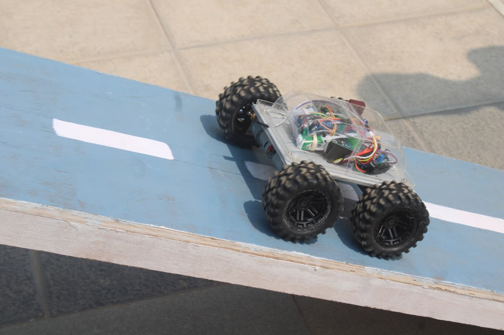
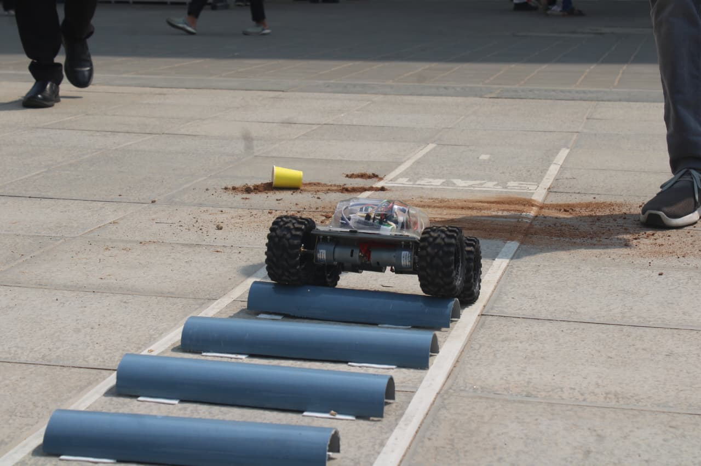
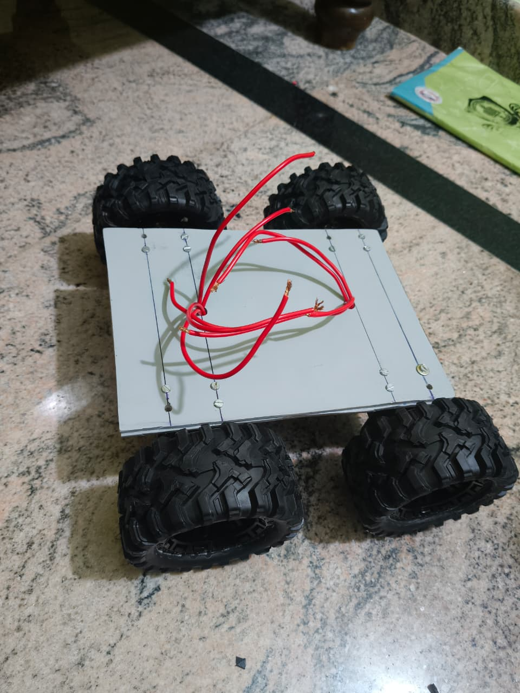
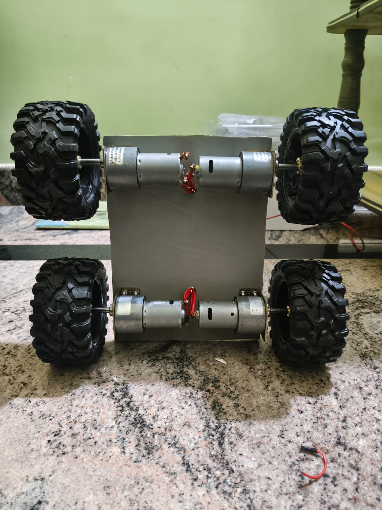
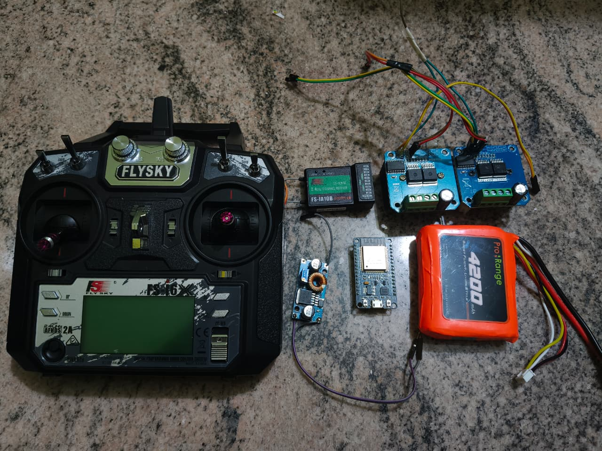

# 🤖 4WD Skid Steer RC Competition Bot

A custom-built 4-wheel drive skid steer robot controlled via FlySky FS-i6X transmitter using iBUS protocol decoded directly on ESP32 — no external libraries. Designed for multi-round robotics competitions covering race, obstacle, and soccer rounds.

---

## 📸 Build Gallery

| On the Race Track | Obstacle Course |
|---|---|
|  |  |

| Chassis with Motors | Motor Side View |
|---|---|
|  |  |

| All Electronics |
|---|
|  |

---

## 🧩 Components Used

- ESP32 DevKit V1
- FlySky FS-i6X Transmitter (10 channel)
- FlySky FS-iA10B Receiver (iBUS output)
- 2× BTS7960 43A H-Bridge Motor Driver
- 4× Johnson Grade A Metal Gear DC Motor — 300 RPM
- Mirana Spectre RC Wheels — 100mm diameter × 50mm wide, hex coupler
- Pro-Range 3S Li-Ion Battery — 4200mAh
- DC-DC Buck Converter Module (set to 5V output)
- Bidirectional Logic Level Shifter (3.3V ↔ 5V)
- 5mm PVC Sheet — chassis 21cm × 15.5cm
- 50A Car Blade Fuse + Inline Fuse Holder (used as power switch)

---

## ✨ Features

- **Raw iBUS parsing** — no external library, custom parser reads all 10 channels over a single wire
- **Skid steer mixing** — throttle and steering combined in code with expo curve for smooth control
- **Throttle priority** — full speed maintained on both sides when turning
- **Launch boost** — minimum PWM threshold ensures motors start immediately from standstill
- **Right motor trim** — flat PWM offset compensates for physical motor speed mismatch
- **Arm switch (CH6)** — bot only moves when armed, safe by default
- **Speed mode (CH7)** — toggle between 100% and 50% power
- **Front/Back invert (CH5)** — instantly designates either end of the bot as "front" without physically turning around — useful when bot ends up facing the wrong direction during a match

---

## 🔌 Pin Connections

### FS-iA10B Receiver → ESP32

| Receiver | ESP32 | Note |
|---|---|---|
| iBUS Servo signal | GPIO 16 (RX2) | Single wire — all 10 channels |
| + | 5V from buck converter | Regulated 5V only |
| GND | GND | Common ground |

### ESP32 → BTS7960 Left Driver

| ESP32 GPIO | BTS7960 Pin |
|---|---|
| GPIO 18 | RPWM |
| GPIO 19 | LPWM |
| GPIO 21 | R_EN + L_EN (tied together) |
| 3.3V | VCC |
| GND | GND |
| Battery + direct | B+ |

### ESP32 → BTS7960 Right Driver

| ESP32 GPIO | BTS7960 Pin |
|---|---|
| GPIO 25 | RPWM |
| GPIO 26 | LPWM |
| GPIO 21 | R_EN + L_EN (same enable pin as left) |
| 3.3V | VCC |
| GND | GND |
| Battery + direct | B+ |

### Motors

| Driver Terminal | Connect to |
|---|---|
| Left driver M+ / M− | Left front + left rear motors in parallel |
| Right driver M+ / M− | Right front + right rear motors in parallel |

### Power

| From | To |
|---|---|
| Battery + → 50A fuse | Main power rail (fuse acts as power switch) |
| Buck converter input | Battery + |
| Buck converter output (5V) | ESP32 VIN, FS-iA10B receiver + |
| ESP32 3.3V | BTS7960 VCC (both drivers) |
| All GNDs | Tied together at one common point |

---

## 📡 Transmitter Setup (FlySky FS-i6X)

**1. Enable iBUS output:**
- `System → RX Setup → Output mode → iBUS`
- Rebind receiver after changing this setting

**2. Assign switches to channels:**
- `Functions → Aux Channels`
- CH5 → SwB — invert switch (2-position)
- CH6 → SwA — arm switch (2-position)
- CH7 → SwC — speed mode (2-position)

**3. No transmitter mixing needed** — all skid steer mixing is handled in ESP32 firmware

**4. Reverse channel if direction feels inverted:**
- `Functions → Reverse → toggle CH1 or CH2` as needed after testing

---

## 🎛️ Tuning Parameters

All key values are defined at the top of the `.ino` file:

| Parameter | Default | What it does |
|---|---|---|
| `DEADZONE` | 8 | Stick center deadzone in µs — increase if bot creeps at rest |
| `SPEED_FULL` | 255 | Max PWM at 100% speed mode |
| `SPEED_HALF` | 127 | Max PWM at 50% speed mode |
| `PWM_MIN_FULL` | 60 | Min PWM to overcome motor stall at full speed |
| `PWM_MIN_HALF` | 40 | Min PWM to overcome motor stall at half speed |
| `EXPO_BLEND` | 0.2 | 0.0 = fully linear, 1.0 = full cubic — lower = more responsive |

---

## 💻 Firmware Setup

1. Install [Arduino IDE](https://www.arduino.cc/en/software)
2. Add ESP32 board support:
   - File → Preferences → Additional Board Manager URLs:
     `https://raw.githubusercontent.com/espressif/arduino-esp32/gh-pages/package_esp32_index.json`
   - Tools → Board → Boards Manager → search `esp32` → install by Espressif (v3.x)
3. Open `esp32_bot_main/esp32_bot_main.ino`
4. Select board: `ESP32 Dev Module`
5. Select correct COM port
6. Upload

> No external libraries required — iBUS parsing is fully custom implemented.

---

## 🔧 Build Notes

- **Common ground is critical** — battery GND, ESP32 GND, both BTS7960 GNDs, and buck converter GND must all connect at a single point. Floating grounds cause erratic motor behaviour.
- **BTS7960 VCC at 3.3V** — connect BTS7960 VCC to ESP32 3.3V pin, not 5V. ESP32 GPIO outputs 3.3V logic so VCC must match for correct switching thresholds.
- **iBUS single wire** — all 10 channels come through GPIO 16 (Serial2 RX). No need to wire individual PWM channels from receiver.
- **Fuse as power switch** — 50A blade fuse in inline holder. Pull to cut power, insert to power on. Acts as overcurrent protection simultaneously.
- **Invert switch** — CH5 swaps throttle and steering axes so either end of the bot can act as the front. Electronics are mounted on top so the bot is single-orientation only — invert switch is purely for redirecting drive direction without physically turning the bot around.
- **Motor direction** — if any motor spins the wrong way, swap M+ and M− wires on that driver. No code change needed.
- **Right motor trim** — if bot drifts to one side, add a flat `RIGHT_COMP_ADD` offset to the slower side PWM after all other processing.

---

## 📄 License

MIT License — free to use, modify, and build upon with attribution.

---

*Chassis, firmware, and wiring all built from scratch.*

